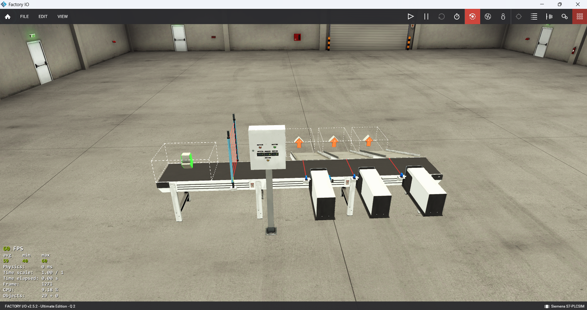
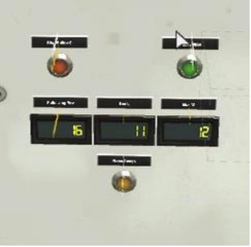

# Project Abstract

This project automates the sorting of boxes based on their height using a Siemens S300 PLC, programmed in Step 7, and simulated in Factory I/O.

- **Conveyor Operation**: 
  - Pressing the Start button activates the conveyor.
  - A height sensor reads the height of each box as an integer and sends it to the PLC's memory.

- **Box Classification**:
  - Heights are compared to predefined thresholds: 
    - 128 for **P(Box)**
    - 192 for **M(Box)**
    - 224 for **L(Box)**
  - Based on the height, boxes are counted and sorted into designated areas.

- **Counting and Display**:
  - A counter increments for each detected box type based on its predefined dimensions.
  - The count of each box type is displayed on the screen in Factory I/O in real time using the MOVE instruction and stored in memory.
  - The display shows the total number of boxes for each dimension category (P, M, L)
    
  

- **Push Mechanism**:
  - Each box type has a dedicated PUSH actuator triggered after passing a secondary sensor. 
  - A short delay ensures precise box placement in its respective area.

- **Control Buttons**:
  - **Start**: Initiates sorting.
  - **Stop**: Halts the process.
  - **Reset**: Resets all counters to zero.

This system effectively integrates height detection, counting, and sorting using PLC programming and Factory I/O for simulation. 
